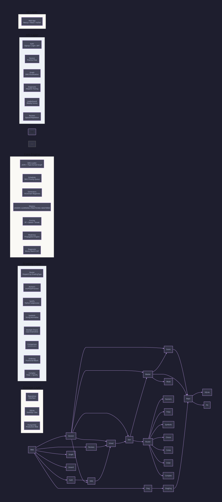
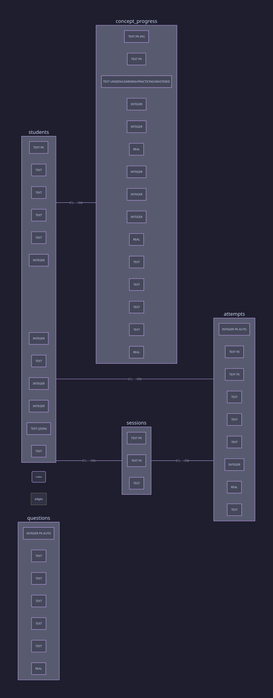
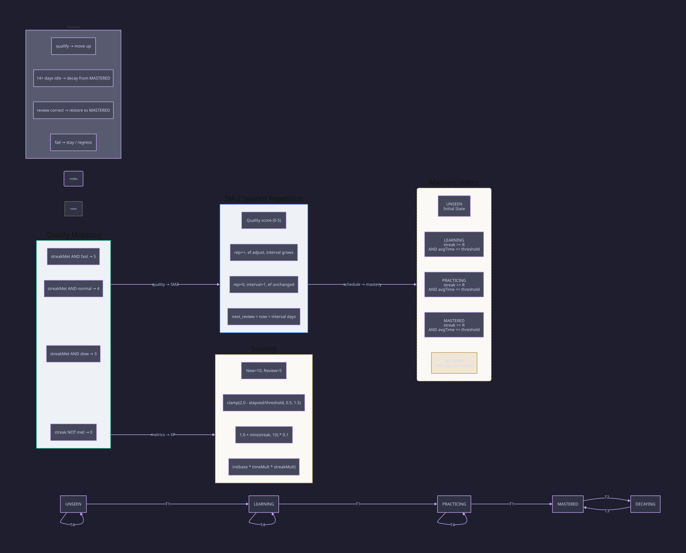
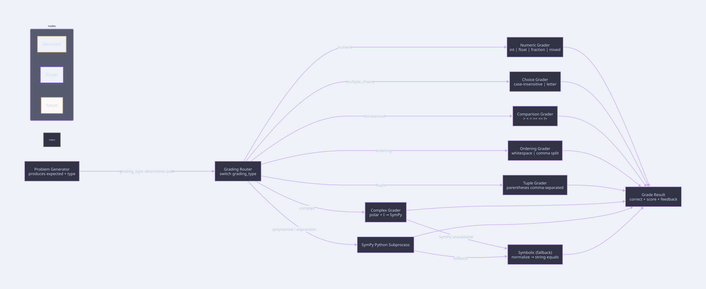
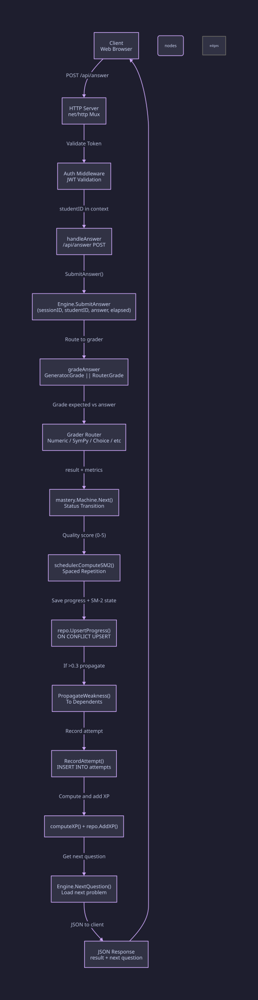
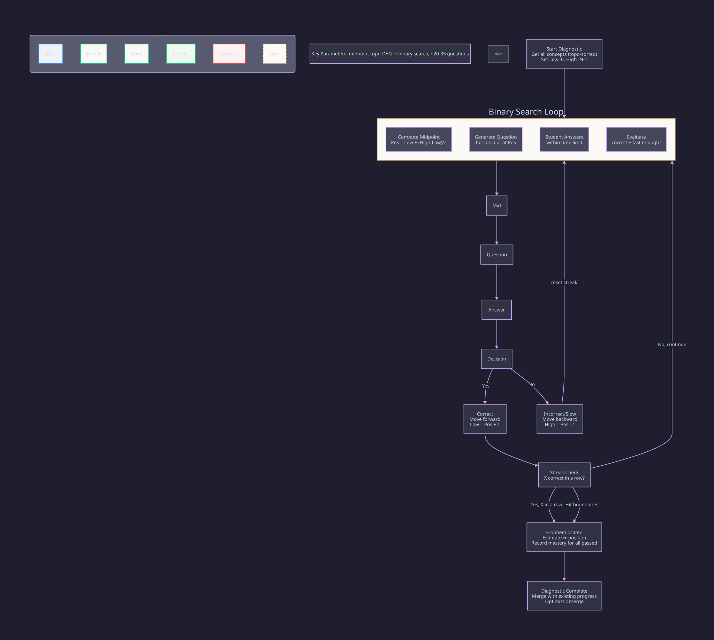

# Mathua System Design

Mathua is an open-source adaptive mathematics learning platform. A single Go binary with web delivery mode  --  Next.js/React static export  --  sharing one engine core.

---

## Table of Contents

1. [High-Level Architecture](#1-high-level-architecture)
2. [Technology Choices](#2-technology-choices)
3. [Database Design](#3-database-design)
4. [Core Engine](#4-core-engine)
5. [SM-2 Algorithm & Mastery](#5-sm-2-algorithm--mastery)
6. [Grading System](#6-grading-system)
7. [API Layer](#7-api-layer)
8. [Frontend Architecture](#8-frontend-architecture)
9. [End-to-End Data Flow](#9-end-to-end-data-flow)
10. [Computerized Adaptive Testing (CAT)](#10-computerized-adaptive-testing-cat)
11. [Key Design Decisions & Trade-offs](#11-key-design-decisions--trade-offs)

---

## 1. High-Level Architecture

Mathua follows a five-layer architecture. All layers are compiled into a single Go binary. The UI layer has a single implementation  --  the web frontend (React/Next.js served as a static export)  --  calling into the same engine through the REST API.



### Layer Breakdown

| Layer | Technology | Responsibility |
|-------|-----------|----------------|
| **UI** | React/Next.js (static export) | Rendering, user interaction, client state |
| **API** | `net/http` (Go stdlib) | REST endpoints, JWT auth, rate limiting, CORS |
| **Core Engine** | Go | DAG loading, SM-2 scheduling, problem generation, mastery tracking, scoring, weakness propagation, CAT diagnostic |
| **Grading** | Go + SymPy (Python subprocess) | 6+ grading strategies dispatched by grading type |
| **Storage** | SQLite (local/dev), PostgreSQL (production) | Persistence via `Repository` interface |

The architecture is streamlined with a single UI delivery method through the REST API.

---

## 2. Technology Choices

| Component | Choice | Rationale |
|-----------|--------|-----------|
| **Language** | Go | Single binary, fast compilation, excellent concurrency for subprocess management |
| **Database** | SQLite / PostgreSQL | SQLite for zero-config offline use; PostgreSQL for concurrent web access |
| **ORM** | None (raw SQL with `database/sql`) | Maximum control over query performance; schema is small enough that an ORM adds unnecessary abstraction |
| **Problem Generation** | Go functions + SymPy | All problems are procedurally generated  --  no static question bank. SymPy handles symbolic math equivalence checking |
| **Frontend** | Next.js 14 (static export) | Server-rendered React, static files served by the Go binary itself |
| **Styling** | Tailwind CSS + CSS custom properties | Dark/light theme through CSS variables, no runtime JS for theming |
| **Auth** | JWT (HS256) with bcrypt | Stateless auth, 30-day tokens, rate-limited endpoints |
| **Diagrams** | D2 | Declarative, auto-layout, pre-rendered to SVG for use in docs and the web app |

---

## 3. Database Design

### Schema Overview

Five core tables: `students`, `concept_progress`, `sessions`, `attempts`, `questions`.



### Table Details

**`students`**  --  User accounts

| Column | Type | Notes |
|--------|------|-------|
| `id` | TEXT PK | UUID |
| `name` | TEXT | Display name |
| `username` | TEXT | Unique login identifier |
| `password_hash` | TEXT | bcrypt hash |
| `course_id` | TEXT | Active course filter |
| `xp_total` | INTEGER | Lifetime XP (`MAX(0, xp_total+?)` floor `sqlite.go:199`) |
| `xp_today` | INTEGER | Resets via `xp_date` check (`MAX(0, …)`) |
| `xp_date` | TEXT | Date of `xp_today` bucket (`YYYY-MM-DD`) |
| `daily_xp_goal` | INTEGER | Daily goal (default 30, migrated from legacy 150 via versioned backfill `sqlite.go`) |
| `settings` | TEXT (JSON) | Arbitrary key-value settings (`pause_until`, `accommodations.extra_time`) |
| `diagnostic_completed` | INTEGER | Boolean flag |
| `share_token` | TEXT | `s_` + 12 random bytes (`engine.go:1270`) |
| `league` | TEXT | `bronze`→`diamond` (`leaderboard`) |
| `league_week` | TEXT | ISO week |
| `league_moved` | INTEGER | Promotion/demotion flag |
| `created_at` | TEXT | ISO 8601 |

**`concept_progress`**  --  Per-concept student state with SM-2 spaced repetition

| Column | Type | Notes |
|--------|------|-------|
| `student_id` | TEXT PK FK | Composite with concept_id |
| `concept_id` | TEXT PK | Maps to DAG concept |
| `status` | TEXT | UNSEEN → LEARNING → PRACTICING → MASTERED |
| `streak` | INTEGER | Consecutive correct answers |
| `sm2_repetitions` | INTEGER | SM-2 repetition count |
| `sm2_interval` | INTEGER | Days until next review |
| `sm2_efactor` | REAL | Easiness factor (≥ 1.3) |
| `next_review_due` | TEXT | ISO 8601 date for spaced repetition |
| `weakness_score` | REAL | 0.0–1.0, propagated to dependents |

**`sessions`**  --  Practice sessions

| Column | Type | Notes |
|--------|------|-------|
| `id` | TEXT PK | UUID |
| `student_id` | TEXT FK | |
| `started_at` | TEXT | ISO 8601 timestamp |

**`attempts`**  --  Individual answer records

| Column | Type | Notes |
|--------|------|-------|
| `id` | INTEGER PK | Auto-increment |
| `session_id` | TEXT FK | |
| `concept_id` | TEXT | |
| `answer` | TEXT | Raw student input |
| `expected` | TEXT | Correct answer |
| `correct` | INTEGER | Boolean (0/1) |
| `elapsed_seconds` | REAL | Response time |
| `timestamp` | TEXT | |

**`questions`**  --  Optional pre-seeded bank

| Column | Type | Notes |
|--------|------|-------|
| `id` | INTEGER PK | |
| `concept_id` | TEXT | |
| `question` | TEXT | |
| `answer` | TEXT | |
| `explanation` | TEXT | |
| `difficulty` | REAL | 0.0–1.0 |

### Indexes

- `concept_progress(student_id)`  --  Fast progress lookups
- `concept_progress(student_id, status, mastered_at)`  --  Weekly leaderboard (`sqlite.go:640` `GetWeeklyLeaderboard`)
- `sessions(student_id)`  --  Session history
- `attempts(session_id)`  --  Attempts per session
- `attempts(student_id, timestamp)`  --  Time-series queries
- `attempts(student_id, concept_id, timestamp)`  --  Aggregate efficacy `GetAllAttempts` (`sqlite.go:470`)
- `questions(concept_id)`  --  Question lookup
- `students(share_token)`  --  Share link lookup (`migrate.go:69`)
- `active_sessions(student_id)`, `active_sessions(attempt_id)`  --  Session recovery
- `student_topic_speed(student_id)`  --  Per-topic learning speed

### SQLite Configuration

```sql
PRAGMA journal_mode=WAL;      -- Concurrent reads during writes
PRAGMA foreign_keys=ON;       -- Referential integrity
PRAGMA busy_timeout=5000;     -- 5s wait before locking error
```

### Migrations

Migrations are embedded directly in the application binary  --  no external migration tool. All DDL uses `CREATE TABLE IF NOT EXISTS`. Incremental migrations use `ALTER TABLE ... ADD COLUMN` guarded by error-checking for duplicate column names.

### Dual-Database Strategy

The `Repository` interface abstracts the storage layer (`store.go:127`):

- **SQLiteStore**  --  Fully implemented (`sqlite.go:1`, `WAL` `migrate.go:23`), used for local dev and `DATABASE_URL=sqlite:mathua.db` / `:memory:` tests
- **PostgresStore**  --  Fully implemented via `pgx/v5/stdlib` (`postgres.go:7` `pgSchema`, `$1` placeholders, `GREATEST` for XP floor, `STRING_AGG` for activity, `RANDOM()` for questions) — used when `DATABASE_URL=postgres://` `main.go:57`

The codebase checks `DATABASE_URL` at startup and opens `pgx` for `postgres://` else `SQLite` (`mathua.db`).

---

## 4. Core Engine

The engine is the central orchestrator. It holds references to every subsystem and coordinates the full practice loop.

### Modules

| Module | File | Responsibility |
|--------|------|----------------|
| **DAG Loader** | `internal/concepts/` (`loader.go:13`, `dag.go`) | Loads `data/concepts/*.json` + `enrichment.json` heuristics (`Encompasses`, `InterferenceGroup`, `Variants`), validates no cycles/orphans/dup IDs, no singletons, encompass cycles, produces topological sort via Kahn's algorithm |
| **Scheduler** | `internal/scheduler/` (`scheduler.go:229`, `scheduler.go:87`) | Selects next concept using priority `0.5×days +0.2×(1-mastery)+0.3×weakness +5 if DECAYING +2 layering −3 interference`, interleaving window (no same subdomain in last 2), top-3 dissimilar + 70/30 new/review balance |
| **Generators** | 17 domain registries (`internal/generator/*`) | Every problem is generated on demand by a parameterized Go function via `Registry.GenerateContext(ctx{Seed,Difficulty})` `generator/registry.go:74` — no static question bank |
| **Mastery Machine** | `internal/mastery/` (`mastery/machine.go:22`, `sm2.go:15`) | State machine: UNSEEN → LEARNING → PRACTICING → MASTERED (with DECAYING at read time `14d` `scheduler.go:194`), SM-2 scaled by per-topic `learningSpeed 0.5–2.0` `sm2.go:15` |
| **Scoring** | `internal/scoring/` | Two scores: lifetime topic score (permanent) and weekly score (resets Monday) + `30` daily XP goal `scoring/updater.go:59` |
| **Weakness Propagation** | In engine `engine.go:1575` | If a concept's weakness > 0.3, propagates `w × 0.3` to dependents |
| **Diagnostic** | `internal/diagnostic/` (`cat.go:1`, `report.go:11`) | Compressed covering set + info-gain CAT with `±0.3` evidence propagation, per-concept `KnowledgeConfidence 0–1`, frontier at max belief drop, supplemental when `<0.7` |
| **Planner** | `internal/planning/` | Course paths loaded from `data/courses.json` (21 courses) |
| **Lessons** | `internal/lessons/` | Markdown lesson content from `data/lessons/` + 580 KP shards `data/lessons/kp/*.json` ×3 `audit_lessons.py:191` |

### DAG (Concept Graph)

Concept relationships are defined as JSON files:

```json
{
  "id": "algebra.quadratic-formula",
  "label": "Quadratic Formula",
  "domain": "algebra",
  "subdomain": "equations",
  "grading_type": "numeric",
  "prerequisites": ["algebra.quadratic-equations", "algebra.square-roots"],
  "mastery_threshold": { "streak": 3, "avg_time_seconds": 0 }
}
```

The DAG loader:
1. Loads all JSON files from `data/concepts/`
2. Validates: no cycles (DFS cycle detection), no orphaned prerequisites, no duplicate IDs
3. Produces a topological sort (Kahn's algorithm)
4. Builds bidirectional maps for `prereqsOf` and `dependentsOf`

### Scheduler

The scheduler selects the next concept using a priority formula:

```
priority = 0.5 × daysSinceLastSeen
         + 0.2 × (1 - masteryScore)
         + 0.3 × weaknessScore
```

Decaying concepts (≥14 days since last review) get `+5` priority bonus. The scheduler then maintains a **70/30 new/review ratio** when selecting from the candidate pool  --  70% of questions should be new material, 30% should be spaced repetition reviews.

---

## 5. SM-2 Algorithm & Mastery



### Mastery State Machine

Four stored states, one computed state:

| State | Transition | Condition |
|-------|-----------|-----------|
| **UNSEEN** → LEARNING | First correct | Streak ≥ required AND avg time ≤ threshold |
| **LEARNING** → PRACTICING | Consistent correct | Same |
| **PRACTICING** → MASTERED | Mastery achieved | Same |
| **MASTERED** → DECAYING | 14+ days idle | Computed at read time, never stored |

The `streak` resets to 0 on any incorrect answer. Each concept has a `required_streak` (typically 3) and a `time_threshold` (typically 120s for generated, 60s for review).

### SM-2 Spaced Repetition

The SM-2 algorithm determines review intervals:

```
quality < 3:
  rep = 0, interval = 1, ef unchanged

quality >= 3:
  rep++
  ef += 0.1 - (5 - q) × (0.08 + (5 - q) × 0.02)
  ef = max(1.3, ef)
  interval:
    rep == 1 → 1 day
    rep == 2 → 6 days
    rep > 2 → round(prev_interval × ef)
```

Quality is derived from correctness and response time:

| Condition | Quality |
|-----------|---------|
| Streak met AND time ratio ≤ 0.5 | 5 |
| Streak met AND time ratio ≤ 1.0 | 4 |
| Streak met AND time ratio > 1.0 | 3 |
| Streak not met | 0 |

### XP Scoring

```
base = 10 (new) or 5 (review)
timeMultiplier = clamp(2.0 - elapsed / threshold, 0.5, 1.5)
streakMultiplier = 1.0 + min(streak, 10) × 0.1
XP = int(base × timeMultiplier × streakMultiplier)
```

### Levels

| Concepts Mastered | Title |
|-----------------|-------|
| 0 | Novice |
| 32 | Apprentice |
| 64 | Student |
| 96 | Scholar |
| 128 | Adept |
| 160 | Expert |
| 192 | Master |
| 224 | Grandmaster |
| 256 | Math Architect |

---

## 6. Grading System

The grading system uses a strategy pattern with a central Router that dispatches to the correct grader based on `grading_type`.



### Grader Strategies

| Grader | Grading Types | Implementation |
|--------|--------------|----------------|
| **Numeric** | `numeric` | Parses integers, decimals, fractions (`3/4`), mixed numbers (`1 1/2`), scientific notation (`1e2`). Strips commas and leading `+`. Uses `big.Rat` for exact rational arithmetic. Float tolerance `1e-9`. |
| **Multiple Choice** | `multiple_choice` | Case-insensitive equality + single-letter matching (e.g., `"B"` matches `"Option B"`). |
| **Comparison** | `comparison` | Operator matching: `>`, `<`, `=`, `>=`, `<=`, `!=`, `==`. |
| **Ordering** | `ordering` | Splits on whitespace/comma/semicolon/pipe. Positional exact match (order-sensitive). |
| **Tuple** | `tuple` | Strips parentheses and semicolons, splits on comma. Positional exact match. |
| **Complex** | `complex` | Preprocesses polar form `r(cos + i sin)`, handles `±`, converts `i` → `I`, delegates to SymPy. |
| **Symbolic (fallback)** | (various) | String equality after normalizing spaces and `**` → `^`. Used when SymPy is unavailable. |
| **SymPy** | `polynomial`, `expression` | Long-lived Python subprocess. Sends JSON via stdin, reads JSON from stdout. |

### SymPy Subprocess Integration

For symbolic math (polynomial simplification, expression equivalence), Mathua spawns a Python subprocess running `grading/sympy_service.py`:

1. **Input**: JSON line on stdin `{id, expected, answer}`
2. **Preprocessing**: Strip variable assignments (`y = ...`), strip `+ C` constants, normalize `e^x` → `exp(x)`, `ln` → `log`, `|x|` → `Abs(x)`, handle implicit multiplication (`2sin(x)` → `2*sin(x)`)
3. **Parsing**: `sympy.parsing.sympy_parser` with implicit multiplication support
4. **Symbolic equivalence**: `simplify(diff) == 0`, `expand(diff) == 0`, `trigsimp`, `radsimp`, `powsimp`, `factor`, `ee.equals(ea)`
5. **Numerical verification**: 10 random points checked within `1e-6` tolerance
6. **Output**: JSON line on stdout `{id, correct, feedback}`
7. **Safeguards**: 10-second `SIGALRM` timeout, 500-character input limit, character allowlist

If Python/SymPy are not installed, grading falls back gracefully to the pure-Go symbolic string normalizer.

---

## 7. API Layer

The web server exposes a REST API through Go's standard `net/http` package. No external HTTP framework.

### Middleware Stack

| Middleware | Purpose |
|-----------|---------|
| `cors` | Sets `Access-Control-Allow-Origin` from `CORS_ALLOWED_ORIGINS` allowlist (`server.go:32`), handles OPTIONS (204), `Vary: Origin` |
| `logRequest` | Logs method and path |
| `authMiddleware` | Reads `Authorization: Bearer <token>`, validates `HS256` JWT (`auth.go:98`), injects `studentID` into context |
| `authLimiter` | Token-bucket rate limiter (5 rate, 10 burst, 1 min window) on auth endpoints `server.go:70` |
| `writeLimiter` | 20 burst, 3s window on write endpoints (`/api/session`, `/api/answer`, `/api/study/answer`, `/api/quiz/*`, `/api/diagnostic`, `/api/goal/*`, `/api/reviews/*`) `server.go:69` |
| `shareLimiter` | 10 burst, 6s window on `GET /api/share/*` `server.go:69` |

### All Routes

| Method | Path | Auth | Purpose |
|--------|------|------|---------|
| POST | `/api/auth/signup` | write: authLimiter | Create account → JWT |
| POST | `/api/auth/login` | write: authLimiter | Login → JWT |
| GET | `/api/auth/me` | Bearer | Current user + scores |
| POST | `/api/session` | write: writeLimiter, optional | Start practice session |
| GET | `/api/session/current` | optional | Peek active question (409 recovery) |
| POST | `/api/answer` | write: writeLimiter, optional | Submit answer → result + next (`MinAnswerSeconds 0.3` `server.go:30`) |
| GET | `/api/progress/{student_id}` | optional | All concept progress |
| GET | `/api/scores/{student_id}` | optional | Aggregated scores |
| GET | `/api/config` | no | `{auth_enabled: bool}` |
| GET | `/api/graph` | no | Full DAG node list |
| GET | `/api/leaderboard` | no | Weekly leaderboard |
| GET | `/api/leagues` | auth | Weekly leagues with promotion/demotion |
| POST | `/api/share` | auth | Enable/disable share link (`s_` token `engine.go:1270`) |
| GET | `/api/share/{token}` | shareLimiter, public | Read-only parent/teacher report |
| GET | `/api/courses` | auth | Available courses (21) |
| GET | `/api/courses/{id}` | auth | Course detail + progress |
| POST | `/api/courses/{id}/diagnostic` | auth | Set course + activate path |
| GET | `/api/transcript` | auth | Transcript JSON or `?format=csv` |
| POST | `/api/diagnostic` | write: writeLimiter | Start CAT diagnostic |
| POST | `/api/diagnostic/answer` | write: writeLimiter | Submit diagnostic answer (correct+fast) |
| POST | `/api/goal` | auth | Prerequisite chain for concept_ids |
| POST | `/api/goal/diagnostic` | write: writeLimiter, optional | Start goal diagnostic |
| POST | `/api/goal/diagnostic/answer` | write: writeLimiter, optional | Submit goal diagnostic answer (graded via stored problem) |
| POST | `/api/goal/plan` | write: writeLimiter, optional | Persist diagnostic + readiness report |
| GET | `/api/weaknesses` | auth | Weakness scores by domain (`weakness >0.2`) |
| POST | `/api/goals/xp` | auth | Set daily XP goal (1–10000) |
| GET/PUT | `/api/settings` | auth | Student settings JSON (`pause_until`, `accommodations.extra_time`) |
| GET | `/api/reviews/due` | auth | Count due reviews (paused → 0) |
| POST | `/api/reviews/session` | write: writeLimiter, auth | Create review-only session |
| POST | `/api/reviews/answer` | write: writeLimiter, auth | Submit review answer |
| GET | `/api/lessons` | no | All lessons with progress (`?student_id=`) |
| GET | `/api/lessons/body` | no | Single lesson markdown body |
| GET | `/api/lessons/{id}/practice` | no | Generated/curated practice questions (`?count=5`) — also stores `studyExpected` for cheat prevention `server.go:1150` |
| GET | `/api/lessons/{id}/kp` | no | KP shards (3 per concept) with worked example |
| GET | `/api/concepts/{id}` | optional | Concept detail + prereqs/dependents/unlocked |
| POST | `/api/study/answer` | write: writeLimiter, optional | Study seam `LessonQuiz→SubmitAnswer` (`CONTEXT.md` Seam) — server-stored expected `engine.go:931`, `student_id` impersonation guard `server.go:1594` |
| POST | `/api/quiz/session` | write: writeLimiter, optional | Quiz every 150 XP at 80% difficulty (`quiz.go:1`) |
| POST | `/api/quiz/answer` | write: writeLimiter, optional | Submit quiz answer (`TaskQuiz 20` `engine.go:1126`) |
| GET | `/api/activity` | auth | Daily activity heatmap (`?days=365`) |
| GET | `/api/efficacy` | auth | First-pass/second-pass efficacy |
| GET | `/api/efficacy/all` | no | Aggregate efficacy across students |
| GET | `/api/health` | no | `{"status":"ok"}` |

### Auth Flow

```
Signup: POST /auth/signup {name, username, password}
  → bcrypt hash password
  → CreateUser in SQLite
  → Generate HS256 JWT with 30-day expiry
  → Return {token, student_id, name}

Login: POST /auth/login {username, password}
  → FindByUsername
  → bcrypt.Compare
  → Generate JWT
  → Return token

Validate: Authorization: Bearer <token>
  → Parse HS256 JWT
  → Extract "sub" → studentID
  → Inject into context
```

JWT secret is from `JWT_SECRET` env var (hex-decoded 32 bytes or raw string ≥ 32 chars), or randomly generated each run.

---

## 8. Frontend Architecture

### Web App (Next.js 14  --  Static Export)

The frontend uses Next.js in static export mode  --  meaning the Go binary serves pre-built HTML/JS/CSS files with no Node.js runtime. This keeps deployment simple: a single Go binary that is both API server and file server.

**Directory structure:**

```
web/next-app/
├── app/                    # Next.js pages (App Router)
│   ├── page.tsx            # Home page
│   ├── diagnose/           # CAT diagnostic flow
│   ├── practice/           # Practice session
│   ├── progress/           # Progress visualization
│   ├── lessons/            # Lesson content
│   ├── leaderboard/        # Weekly scores
│   └── docs/               # Documentation
├── components/             # Shared React components
│   ├── Header.tsx          # Sticky nav bar
│   ├── D2Diagram.tsx       # Diagram renderer
│   ├── FormulaBlock.tsx    # KaTeX formula display
│   └── ...
├── diagrams/               # D2 source files
├── public/diagrams/        # Pre-rendered SVGs
└── tailwind.config.js      # Custom theme
```

**State management:** Each page manages its own state with React hooks (`useState`, `useEffect`). No global state library  --  the API is the source of truth.

**API client:** Axios-based, with a thin wrapper in `lib/`.

**Theming:** CSS custom properties for dark/light mode. Uses a warm palette: dark backgrounds are `#0b0f1a` (not pure black), light surfaces are `#fefcf4` (warm parchment). Gold accent (`#c8a96e`) marks mastery and structure.

---

## 9. End-to-End Data Flow

Here's the complete flow when a student submits an answer:



### Step-by-Step

1. **Client** sends `POST /api/answer` with `{session_id, answer, elapsed_seconds}`
2. **Auth middleware** validates JWT, injects `studentID` into request context
3. **Handler** calls `Engine.SubmitAnswer(sessionID, studentID, answer, elapsed)`
4. **Grading**  --  route to the correct grader based on `grading_type`: numeric graders parse the answer, SymPy handles symbolic equivalence, etc.
5. **Machine**  --  `mastery.Machine.Next()` determines if the student's performance qualifies for a state transition (UNSEEN → LEARNING → etc.)
6. **SM-2**  --  `scheduler.ComputeSM2()` computes new repetition count, interval, and easiness factor
7. **Upsert**  --  `repo.UpsertProgress()` saves all state (including SM-2 fields) with an SQLite `ON CONFLICT ... DO UPDATE` query
8. **Weakness**  --  if the concept's weakness score exceeds 0.3, propagate to dependent concepts at `w × 0.3`
9. **Attempt**  --  `repo.RecordAttempt()` inserts a row into the `attempts` table
10. **XP**  --  `computeXP()` calculates XP using base, time, and streak multipliers, then `repo.AddXP()` updates the student record
11. **Next**  --  `Engine.NextQuestion()` loads the next concept from the scheduler and asks the generator registry to produce a new problem
12. **Response**  --  JSON response with result, next question, and session state

Total latency target: under 100ms for numeric grading, under 500ms for SymPy-based grading (including subprocess round-trip).

---

## 10. Computerized Adaptive Testing (CAT)

Mathua implements a compressed-covering + info-gain CAT to locate a student's knowledge frontier quickly. Instead of testing all 580 concepts, the diagnostic requires approximately 25–45 adaptive questions.



### Algorithm (`internal/diagnostic/cat.go:1`, `report.go:11`)

1. Load all concepts in topological order (from the DAG)
2. Build a minimal covering set via `compressedCover()` over the DAG’s prerequisite closure
3. Repeatedly pick the concept with maximal `infoGain()` (max entropy reduction at `~0.5` belief)
4. Generate a question; grade `correct+fast` vs `correct` vs `wrong`
5. Propagate evidence: **correct** → `+0.3` belief to all prerequisites; **wrong** → `-0.3` to all dependents + related (Bayes conflict weighting)
6. Track per-concept `KnowledgeConfidence 0–1`; `Frontier` is the highest belief drop between sorted beliefs
7. Stop when every concept has `≥2` probes and `confidence ≥0.7`; otherwise run `supplementalDiagnostic()` to probe low-confidence concepts
8. Report `DiagnosticReport{PlacementCourseID, FrontierIdx, GapsByDomain, MasteryLevels, CompletionEstimates}` (`report.go:11`) with `150 XP` completion estimates

### Key Properties

- **Covering-set + info-gain efficiency**: `25–45` probes vs `580` exhaustive; `80%` difficulty targeting via `engine.computeDifficulty` `engine.go:157`
- **Evidence propagation**: correct boosts prereqs, wrong penalizes postrequisites — finds frontier even with conflicting evidence
- **Mastery + automaticity**: `fast` (`elapsed < timeThreshold`) distinguishes `PRACTICING` vs `LEARNING` placement
- **Optimistic merge**: Retaking does not delete progress; `ApplyGoalResults` `engine.go:1364` merges with `Practicing/Learning` vs `Unseen`
- **Time-bounded**: Per-concept `AvgTimeSeconds` threshold; slow answers are `!fast` for diagnostic purposes

### Goal-Oriented Diagnostic

A variant that targets a specific set of concept goals. Instead of starting at the DAG midpoint, it:
1. Collects all prerequisite chains for the target concepts
2. Runs binary search only within the prerequisite subspace
3. Produces a readiness assessment: which prerequisites are mastered and which need work

---

## 11. Key Design Decisions & Trade-offs

### Why Go over Python or Node.js?

| Factor | Go | Python | Node.js |
|--------|-------|--------|---------|
| Single binary deploy | ✅ Yes | ❌ Requires runtime | ❌ Requires runtime |
| SymPy subprocess | ✅ Natural with `os/exec` | ✅ Native | ⚠️ Indirect |
| Concurrency | ✅ Goroutines | ⚠️ GIL | ✅ Event loop |
| Compile-time safety | ✅ Strong | ❌ Runtime | ❌ Runtime |
| Startup time | ✅ ~5ms | ❌ ~500ms | ⚠️ ~100ms |

The biggest win: a single ~15MB binary that is both API server and static file server. Deploy with `scp mathua user@server: && ./mathua --serve`.

### Why SQLite + PostgreSQL (not just one)?

| Scenario | Database | Reason |
|----------|----------|--------|
| Student running locally | SQLite | Zero config, no server, file-based |
| Self-hosted / homelab | SQLite | Same binary, just point at a path |
| Multi-user web deployment | PostgreSQL | Concurrent writes, connection pooling |
| CI / Tests | SQLite (`:memory:`) | Fast, isolated, reproducible |

The `Repository` interface makes this transparent. The schema is identical across both databases.

### Why Generated Questions (not a static bank)?

- **Infinite variety**: Every session is unique
- **No cheating**: A static bank can be memorized and shared
- **Adaptive difficulty**: Parameters can be tuned in real-time based on student performance
- **No storage**: Questions are generated on-demand and never persisted

Trade-off: generation latency. Complex polynomial questions require a SymPy subprocess round-trip (typically 50–200ms). Simple numeric questions are pure Go and take <1ms.

### Why No ORM?

The schema has 5 tables with straightforward relationships. Raw SQL with `database/sql` gives:
- Full control over query optimization (especially the SM-2 upsert and leaderboard queries)
- No query generation overhead
- Transparent SQL for debugging
- Easy to port between SQLite and PostgreSQL

Trade-off: more boilerplate for CRUD operations. Worth it for the control over the SM-2 upsert query and leaderboard computation.

### Why D2 over alternatives?

The project previously used Mermaid. D2 provides:
- Superior auto-layout (especially for directed graphs with many nodes)
- Cleaner syntax  --  declarative, readable, version-control friendly
- First-class theme support (light/dark themes via `-t 0` / `-t 200`)
- Pre-rendered SVGs  --  no runtime rendering cost

### Why Static Next.js Export (not SSR)?

The Go binary serves the Next.js static export directly. This means:
- No Node.js server needed in production
- A single port for both API and static files
- Simpler deployment  --  just the Go binary plus the `out/` directory
- Trade-off: no server-side rendering, but for a learning app this is acceptable

---

## Summary

Mathua is an intentionally simple system. One language (Go), two databases (SQLite + PostgreSQL via `pgx/v5` `storage/postgres.go:7` / `storage/sqlite.go:1`, same `Repository` `store.go:127`), one engine core with a single delivery method through the REST API. The complexity is in the algorithms  --  SM-2 spaced repetition scaled by `learningSpeed`, CAT compressed-cover + info-gain diagnostics, 17 domain registries (580 concepts), 9 grading types via `Router`  --  not in the infrastructure. Every component can be understood by reading its source file start to finish.

